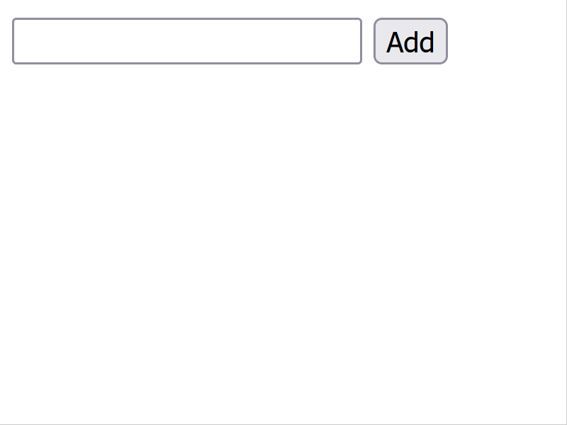

# 練習問題 15 章 15.1-3

## 問題 15.1-3.1 💻🖋️📄

これから 15.1 から 15.3 で学んだ知識を使って以下のような簡単な ToDo 管理アプリケーションを作りなさい。



このアプリケーションを利用すると以下のような HTML ドキュメントがブラウザに表示されることが期待されます。

```html
<!DOCTYPE html>
<html lang="ja">
  <head>
    <title>Simple ToDo</title>
    <meta charset="utf-8" />
    <meta name="viewport" content="width=device-width" />
    <script type="module" src="/ch15.01-03/ex01/index.js"></script>
  </head>
  <body>
    <form id="new-todo-form">
      <input type="text" id="new-todo" placeholder="What needs to be done?" />
      <button type="submit">Add</button>
    </form>

    <ul id="todo-list">
      <li>
        <div>
          <input type="checkbox" />
          <label style="text-decoration-line: none">歓迎会会費徴収</label>
          <button>❌</button>
        </div>
      </li>
      <li>
        <div>
          <input type="checkbox" checked />
          <label style="text-decoration-line: line-through">交通費精算</label>
          <button>❌</button>
        </div>
      </li>
    </ul>
  </body>
</html>
```

問題:

1. index.js を変更し ToDo アプリケーションを完成させなさい。仕様に関してはテストコードを参照しなさい。ただし index.html ファイルは編集してはいけません。
2. index.html ファイル内の script タグから `type="module"` 属性を削除した場合、期待通り動作させるにはどうすべきか答えなさい。

**出題範囲 15.1-3**

## 問題 15.1-3.2 💻🖋️

ブラウザで動的なスクリプトの[インポート](https://developer.mozilla.org/ja/docs/Web/JavaScript/Reference/Operators/import) (`await import(url)`) できる環境を構築して動作確認しなさい (可能ならば cross-site にしなさい)。

またその動作確認方法を文書で記述しなさい。

**出題範囲 15.1.1.4**

## 問題 15.1-3.3 💻🧪🖋️

自作のスクリプトに対し script タグで integrity 属性を付けると、適切な integrity 値の場合はロードされ、そうでない場合ロードされないことを確認しなさい。またこのようなセキュリティ機能があるとどのような攻撃を防御できるか記述しなさい。

**出題範囲 15.1.1**

## 問題 15.1-3.4 🖋

グローバルオブジェクトを参照する方法を、ブラウザ内、node内、ブラウザnode問わずの３種記しなさい。<br>
また、ブラウザとnodeのグローバルオブジェクトのプロパティやメソッドを比較し、ブラウザ独自のものを10程度記しなさい。<br>
最後に、グローバルオブジェクトにundefinedが定義されていることを確認し、過去のES仕様でどのような問題が発生していたかを記しなさい。


**出題範囲 15.1.3**

## 問題 15.1-3.5 💻

index1.html と index2.html についてなるべく速くスクリプトがロードされて画面に"Hello"と表示されるようにしなさい。

ただし、以下の書き換えのみが許可される。

1. script タグに async="true"を付与
2. script タグに defer="true"を付与
3. js 内の処理を document.addEventListener("domcontentloaded", () => {})で囲む
4. js 内の処理を window.addEventListener("load", () => {})で囲む

ヒント: ロードされる速さはデベロッパーツールでネットワークタブを開きキャッシュを無効化にチェックを付けてリロードすると確認できる

**出題範囲 15.1.5.2**

## 問題 15.1-3.6 💻

navigator から取得できる要素をページ中に描画して詐欺サイト風に PC 情報を羅列してリテラシが低い人の不安を煽る画面を作りなさい

画面イメージ: https://ascii.jp/elem/000/000/449/449681/

**出題範囲 15.1.6**

## 問題 15.1-3.7 🖋

自分が運営する販売サイトにYouTubeのトップページをiframeで組込み、更に自作のscript.jsによりiframe内のデータを分析しようとしています。

```html
<iframe id="other" src="https://www.youtube.com/"></iframe>
<script src="./script.js"></script>
...
```
```js
(async () => {
  // YouTube が利用者に推薦する動画タイトルを取得すれば、利用者に最適な商品セットを表示できるのではないか？
  const titles = document.getElementById("").contentWindowquerySelectorAll('#video-title');
  for (const t of titles) {
    await fetch("your-server-path", { method: "POST", body: t.textContent })
  }
});
```

しかし、トップページを読み込むとエラーになります。用語「クリックジャッキング」を調べて理由を説明しなさい。<br>
また、script.jsも動作しません。ここで、同一オリジンポリシーがなく、iframe内の他サイトのDOM変更が可能な仕様を想定し、どのような重大な問題が発生しうるか記載しなさい。

**出題範囲 15.1.8.2**

## 問題 15.1-3.8 💻

提供している index.html と data.json は `npm run server` を実行することで、ローカルホスト上で提供できます。
ブラウザから http://localhost:3000/ch15.01-03/ex08 にアクセスすることで index.html を開けます。
index.html は data.json の値を参照しています。

何者かにサーバーに侵入され data.json が改ざんされた可能性があるとします。攻撃者はどのような data.json の改ざんを行ったでしょうか。実際に XSS が発生する data.json に書き換えなさい。

**出題範囲 15.1.8.3**

## 問題 15.1-3.9 🖋️

React, jQuery などの主要なフロントエンドフレームワークを選び、そのフレームワークを使っていればどのように XSS 対策がされるか、また使っていてもどのような XSS の危険が残るか記述しなさい。

**出題範囲 15.1.8.3**

## 問題 15.1-3.10 💻📄

div 要素とテキスト input 要素が以下のようにイベント処理されるように実装を追加しなさい。

1. div 要素をクリックすると input 要素が focus される
2. div 要素は通常白色で input 要素に focus されると灰色 (silver)になる (input 要素から focus が外れると白色に戻る)
3. input 要素に入力された text は div 要素にも表示される

**出題範囲 15.2**

## 問題 15.1-3.11 💻

以下のhtmlを開き、ボタン押下時のコンソール出力結果を確認しなさい。<br>
次にcaptureの値を変更しdivとbuttonのコンソール出力順序が逆になることを確認しなさい。<br>
更にscript中のコメント1.～4.の指示に従いカスタムイベントの関連コードを完成させなさい。<br>
最後にブラウザのデバッグツール(Chromeの場合はDeveloper ToolのEvent Listners)で、btn等に登録されているイベントをそれぞれ確認しなさい。


```html
<!doctype html>
<html lang="en">
  <head>
    <meta charset="UTF-8" />
    <meta name="viewport" content="width=device-width, initial-scale=1.0" />
    <title>EVENT propagation, dispatch</title>
    <script type="module">
      const div = document.querySelector("#div");
      const btn = document.querySelector("#btn");
      div.addEventListener(
        "click",
        () => {
          console.log("div");
        },
        { capture: true },
      );
      btn.addEventListener("click", () => {
        console.log("button");
      });

      class RandomEventTarget extends EventTarget {
        constructor() {
          super();
        }

        trigger() {
          const randomNumber = new CustomEvent("random", {
            detail: Math.random(),
          });
          this.dispatchEvent(randomNumber);
        }
      }

      const randomEventTarget = new RandomEventTarget();

      // 1. htmlのpタグ要素を生成しなさい。また、ボタン要素の直後の位置にpタグ要素を配置しなさい。

      randomEventTarget.addEventListener("random", (e) => {
        // 2. 生成済みのpタグ要素のテキストに、イベントの保持する乱数値を代入しなさい。
      });

      // 3. ボタンにイベントリスナを追加し、ボタン押下するごとに乱数値を変更しなさい。変更にはRandomEventTargetのtriggerメソッドを利用しなさい。

      // 4. RandomEventTargetのtriggerメソッドによってイベントを発生させて、ページ読み込み時に乱数値を表示しなさい。

    </script>
  </head>
  <body>
    <div id="div">
      <button id="btn">ボタン</button>
    </div>
  </body>
</html>

```


**出題範囲 15.2.1/15.2.4**

## 問題 15.1-3.12 💻

この章で学んだ知識を使って自分にとって役に立つブックマークレットを作成しなさい。

注意事項:

- ブックマークレットにはパスワードなど機密情報は含めないこと
- 社内システム向けのブックマークレットの場合は GitHub に公開しないこと (当日の会議チャットに添付しなさい)

ブックマークレットの案:

- 交通費精算の入力を省力化する
- 勤怠の入力を省力化する
- Chrome 内蔵の Gemini nano を使って選択範囲のテキストを要約する

**参考**: [Bookmarklet という一番身近な自動化技術](https://blog.jxck.io/entries/2018-01-12/let-it-bookmarklet.html#bookmarklet)

**出題範囲 15.3**

## 問題 15.1-3.13 💻

index.html に対して以下の要素を CSS セレクタで指定して console.log に表示しなさい

1. nav 要素内のリンク (`<a>`)
2. 商品リスト (.product-list) 内の最初の商品 (.product-item)
3. カートアイコンの画像 (``)
4. 商品リスト (.product-list) 内の価格 (.price) を表示する要素
5. 商品リスト (.product-list) 内の全ての商品 (.product-item) の画像 (``)
6. 検索バー (.search-bar) 内の検索ボタン (`<button>`)
7. フッター (footer) 内のパラグラフ (`<p>`) 要素
8. 商品リスト (.product-list) 内の偶数番目の商品 (.product-item)
9. ヘッダー (header) 内のアカウントリンク (.account) の画像 (``)
10. ナビゲーションリンクのうち、"会社情報" のリンク

**出題範囲 15.3.1.1**

## 問題 15.1-3.14 💻🧪

下記の html を完成させ、ドロップダウンリストで選んだものだけが表示されるようにしなさい。また playwrite を使って e2e テストを書きなさい。

```html
<!doctype html>
<html lang="ja">
  <head>
    <meta charset="UTF-8" />
    <meta name="viewport" content="width=device-width, initial-scale=1.0" />
    <title>Product List</title>
    <script type="module">
      document
        .getElementById("category-select")
        .addEventListener("change", (e) => {
          const selectedCategory = e.target.value;
          const products = document.querySelectorAll("#productList li");
          products.forEach((product) => {
            // ここにコードを書いて完成させる
          });
        });
    </script>
  </head>
  <body>
    <select data-testid="select" id="category-select">
      <option value="all">すべて</option>
      <option value="food">食品</option>
      <option value="stationery">文房具</option>
    </select>
    <ul id="productList">
      <li data-testid="food1" data-category="food">お菓子 - ¥1000</li>
      <li data-testid="stationery1" data-category="stationery">
        消しゴム - ¥200
      </li>
      <li data-testid="stationery2" data-category="stationery">
        ものさし - ¥300
      </li>
    </ul>
  </body>
</html>
```

**出題範囲 15.3.1.1**
