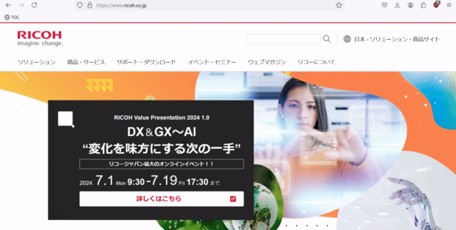
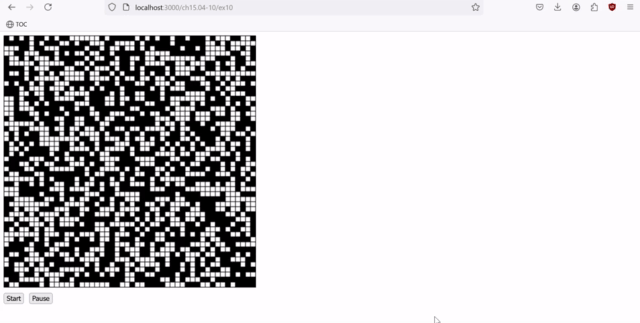
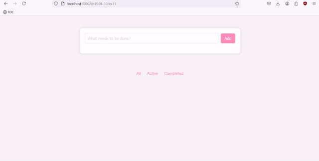

# 練習問題 15 章 15.4-10

## 問題 15.4-10.1 💻

CSS の力を体感してみよう。CSS 自体の学習はそれだけで 1 冊の本になってしまうため、この問題では ChatGPT を使って CSS を生成する (JavaScript に関してはこれまで通り出来る限り生成 AI を使わずに解答しなさい)。

[ex01](ex01) は問題 15.1-3.1 を少し改良した ToDo アプリである。

1. このアプリの見た目を変更する CSS を ChatGPT で生成させて style.css を置き換えなさい。
2. 1 で作成した CSS が何をしているか調査し、以下の例を参考に各セレクタ単位で最低 1 行のコメントを書きなさい。
   調査の際はブラウザの開発者ツール (問題 15.4-10.3 参照) を使い、各 CSS をオン・オフするとどうなるか確認すると良い。

```css
/* 幅 600px で影と丸みを付けて中央に配置 */
main {
  max-width: 600px;
  margin: 50px auto;
  padding: 20px;
  background-color: #ffffff;
  border-radius: 10px;
  box-shadow: 0 0 10px rgba(0, 0, 0, 0.1);
}
```

**ヒント**: ChatGPT のプロンプトの例は以下 (各自「ポケモンのピカチュウ風のデザインにして」など工夫してみなさい):

````
以下の HTML, JavaScript および CSS は ToDo アプリのソースコードです。CSS を変更して見栄えを良くしてください。

```html
{ここに index.html の内容を貼り付ける}
```

```js
{ここに index.js の内容を貼り付ける}
```

```css
{ここに style.css の内容を貼り付ける}
```
````

**参考**: プロンプトのテクニックについてより深く学びたい場合は [Prompt engineering](https://platform.openai.com/docs/guides/prompt-engineering/tactic-use-delimiters-to-clearly-indicate-distinct-parts-of-the-input) を参照。

**出題範囲**: 15.4

## 問題 15.4-10.2 🖋️💻

昨今では CSS を 1 から自分で書くことは少なく、何らかのフレームワークを利用することが一般的である。
この問題では 2024 年現在流行している [Tailwind CSS](https://tailwindcss.com/) を利用する。

1. [Tailwind CSS](https://tailwindcss.com/) がどういったフレームワークか調べなさい。
2. [ex02](ex02) の index.html および index.js を Tailwind CSS を使うように書き換えなさい。ChatGPT を使って [ex02/README](ex02) を参考に style.css を生成しなさい (HTML, JavaScript, CSS を解答として提出すること)。

**ヒント**: ChatGPT のプロンプトの例は以下:

````
以下の HTML および JavaScript は ToDo アプリのソースコードです。
Tailwind CSS を使う前提で HTML と JavaScript のコードを書き換えて見栄えを良くして下さい。
注意: HTML と JavaScript は1つのファイルにせず分けて出力して下さい。

```html
{ここに index.html の内容を貼り付ける}
```

```js
{ここに index.js の内容を貼り付ける}
```
````

**出題範囲**: 15.4

## 問題 15.4-10.3 🖋️

ブラウザの開発者ツールを使うと CSS のデバッグを効率的に行うことができる。
[CSS のデバッグ](https://developer.mozilla.org/ja/docs/Learn/CSS/Building_blocks/Debugging_CSS) を参考にして以下を実施しなさい:

1. 15.4-10.1 および 15.4-10.2 の ToDo アプリに対してブラウザの開発者ツールから値の変更やプロパティの追加を試してみなさい
2. 開発者ツールで CSS に関して実行できる操作を検索エンジンで調べ、便利だと思ったものを 3 つ挙げなさい
3. 15.4-10.2 のアプリの `body` 要素に対し、元々 HTML および JS 内で利用していなかった Tailwind CSS のクラス (`bg-rose-600` など何でも良い) を開発者ツールから追加すると変更が反映されないが、これは何故か調べなさい

**出題範囲**: 15.4

## 問題 15.4-10.4 💻

この問題では 15.3.6 の例 (目次の作成) を変更する。
[ex04/TOC.js](ex04/TOC.js) は例を少し修正した内容である。以下の順に進めなさい:

1. 適当な Web サイトを開き、ブラウザの開発者ツールに TOC.js の内容を貼り付けて実行してみなさい
2. TOC.js をブックマークレットにして簡単に実行できるようにしなさい (`javascript:{TOC.js のコード}` というブックマークを作成)
3. 下記の例を参考にして目次を選択した時にスムーズに遷移するようにしなさい

```js
let link = document.createElement("a");
link.href = `#${fragmentName}`;
link.innerHTML = heading.innerHTML;

/* 追加分 */
link.addEventListener("click", (e) => {
  e.preventDefault();
  const target = document.querySelector(`a[name="${fragmentName}"]`);
  if (!target) {
    return;
  }

  /* NOTE: scrollTo または scrollIntoView でスムーズにスクロールしなさい  */
});
```

**参考**: 完成後のイメージは以下:



**出題範囲**: 15.5

## 問題 15.4-10.5 💻🧪

`<inline-circle>` カスタム要素に適当な属性を追加しなさい (例: `border-color`)。
作成した `<inline-circle>` を HTML で読み込んで表示しなさい。

**出題範囲**: 15.6

## 問題 15.4-10.6 💻

[ex06/index.js](ex06/index.js) の続きを実装し Web Components を使った ToDo アプリを完成させなさい。

**補足**: この問題では ToDo アプリ全体を 1 つの Web Components (`<todo-app>`) としたが [TodoMVC の例](https://github.com/tastejs/todomvc/tree/master/examples/web-components) のように複数の Web Components に分けて実装する方法も考えられる。

**出題範囲**: 15.6

## 問題 15.4-10.7 🖋️

.png 画像や .jpeg 画像と比べた際の SVG のメリット・デメリットを調査しなさい。

**出題範囲**: 15.7

## 問題 15.4-10.8 💻

アナログ SVG 時計に秒針を追加しなさい。HTML は変更しないこと。

**出題範囲**: 15.7

## 問題 15.4-10.9 💻

[ex09](ex09) は画像のグレースケール変換を行うデモである。
このプログラムを変更し、グレースケール変換ではなくガウシアンフィルタ (最低 5x5) によるぼかし処理を実施しなさい。

**出題範囲**: 15.7

## 問題 15.4-10.10 💻

[ex10](ex10) の続きを実装し [ライフゲーム](https://en.wikipedia.org/wiki/Conway%27s_Game_of_Life) のプログラムを完成させなさい。

**参考**: 完成後のイメージは以下:



**出題範囲**: 15.7

## 問題 15.4-10.11 💻🧪

[ex11](ex11) の続きを実装し、完了または未完了の ToDo のみ表示できるような ToDo アプリを完成させなさい。

補足: `// ここを実装してね` 以外の実装を変更してもよい。ToDoの完了や削除を`Active`や`Completed`画面に反映させるためには、それぞれの操作に対するイベントリスナーも修正する必要がある。

**参考**: 完成後のイメージは以下:



**出題範囲**: 15.10

## 問題 15.4-10.12 🖋️💻

15.4-10.11 は hashchange を利用した。もし以下のように pushState を利用した実装にした場合どうなるだろうか？ 途中までの実装を [ex12](ex12) に用意した。

```html
<footer>
  <li><a id="all">All</a></li>
  <li><a id="active">Active</a></li>
  <li><a id="completed">Completed</a></li>
</footer>
```

```js
document.querySelector("#active").addEventListener("click", (e) => {
  e.preventDefault();
  window.history.pushState(null, "", "/ch15.04-10/ex12/active");
  renderTodos(/* TODO: ここは自分で考えてみて下さい (ex11 の答えに近いので) */);
});
```

- Active や Completed を選択後にブラウザのリロードを行うとどうなるだろうか。hashchange と pushState それぞれの実装について調べなさい
  (ヒント: 開発者ツールでどのような通信が発生しているか調べてみなさい)。
- ここまでの例は [serve](https://www.npmjs.com/package/serve) コマンドで HTML や JS といったファイル配信するサーバーを立ち上げてきた。
  サーバー側がどのような挙動をすれば pushState を使った実装が期待通り動作するか考えて答えなさい。

**出題範囲**: 15.10

## 問題 15.4-10.13 🖋️

15.4-10.11 では `#/` や `#/active` といった URL を利用した。
少し昔だとこのような URL は `#!/` や `#!/active` と `!` を付けることもあった (もしかしたら職場でそのようなコードを見るかもしれない)。
このような形式を当時は hashbang と呼んだ。どうしてこのようなスタイルが存在したのだろうか。

**参考**: [Twitter がページ表示時間を 5 分の 1 に高速化。どのようなテクニックを使ったのか？](https://www.publickey1.jp/blog/12/twitter51.html)

**出題範囲**: 15.10

## 問題 15.4-10.14 🖋️

昨今の Web アプリケーションフレームワークで `pushState` がどう使われているか調べよう。以下の手順に従って実験しなさい:

まず適当なディレクトリで以下のコマンドを実行し sandbox プロジェクトを作成する:

```sh
> npx create-next-app sandbox --ts --tailwind --app --use-npm --eslint --no-src-dir  --no-import-alias
```

次に作成された sandbox プロジェクトに移動し実行する:

```sh
> cd sandbox
> npm run dev
...
```

http://localhost:3000 や http://localhbost:3001 といった URL で Web サービスが実行されていることを確認できる (ポート番号は上記コマンドの出力を参照)。

では次に app/foo/page.tsx および app/bar/page.tsx を以下のように作成しよう:

```jsx
// app/foo/page.tsx
import Link from "next/link";

export default function Foo() {
  return (
    <div>
      This is Foo!
      <br />
      (move to <Link href="bar">Bar</Link>)
    </div>
  );
}

// app/bar/page.tsx
import Link from "next/link";

export default function Bar() {
  return (
    <div>
      This is Bar!
      <br />
      (move to <Link href="foo">Foo</Link>)
    </div>
  );
}
```

上記のファイルを追加によって http://localhost:3000/foo や http://localhbost:3001/foo といったページが追加される (`serve` が 3000 番ポートを既に利用中の場合は注意)。

それではブラウザの開発者ツールで以下を実行し `pushState` の呼び出しがログに出力されるようにした状態でリンクを選択するとどうなるだろうか？

```js
window.history.pushState = new Proxy(window.history.pushState, {
  apply: (target, thisArg, argArray) => {
    console.log("pushState is called:", argArray);
    return target.apply(thisArg, argArray);
  },
});
```

問題:

- ブラウザの開発者ツールの「ネットワーク」タブを確認してみよう。リンクをクリックしたときに通信は発生しているだろうか？
- pushState はいつ実行されているだろうか？
- 15.4-10.12 では pushState を使った実装でページのリロード時に正しく動作しなかったが、この問題ではどうだろうか？

この問題を通して「昨今のフレームワークはリンク (通常は `<a>` タグを利用) ですら内部で複雑なことを実施している」ことが伝われば幸いである (もしかしたらトラブル時に知っておくと助けになるかもしれない)。余談だが [Next.js App Router と控えめにお付き合いして普通の Web アプリを配信する](https://zenn.dev/overflow_offers/articles/20240112-using-nextjs-app-router-sparingly) のように `<Link>` を使わないスタイルも存在する。

**出題範囲**: 15.10
