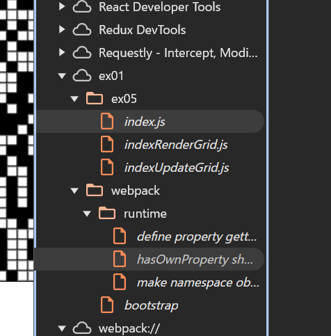
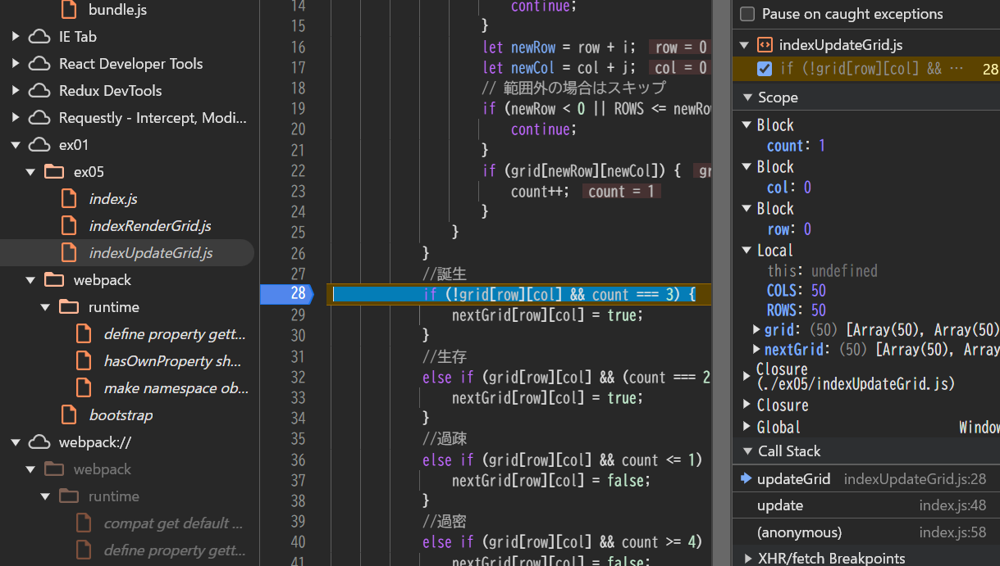

bundle.js.mapが新規に

Q. 開発者ツールで ソース タブ(Chrome, Edge, Safari) または デバッガー タブ(Firefox) を開き、ソースコードファイルがどのように表示されるかを確認しなさい。
これのex01/ex05の中?

バンドルしたコードの実行中に、バンドル前のソースコードファイルに基づいたブレークポイントの設定や変数の値の確認等のデバッグが可能か確認しなさい。
ブレイクポイントや変数の値は参照可能
